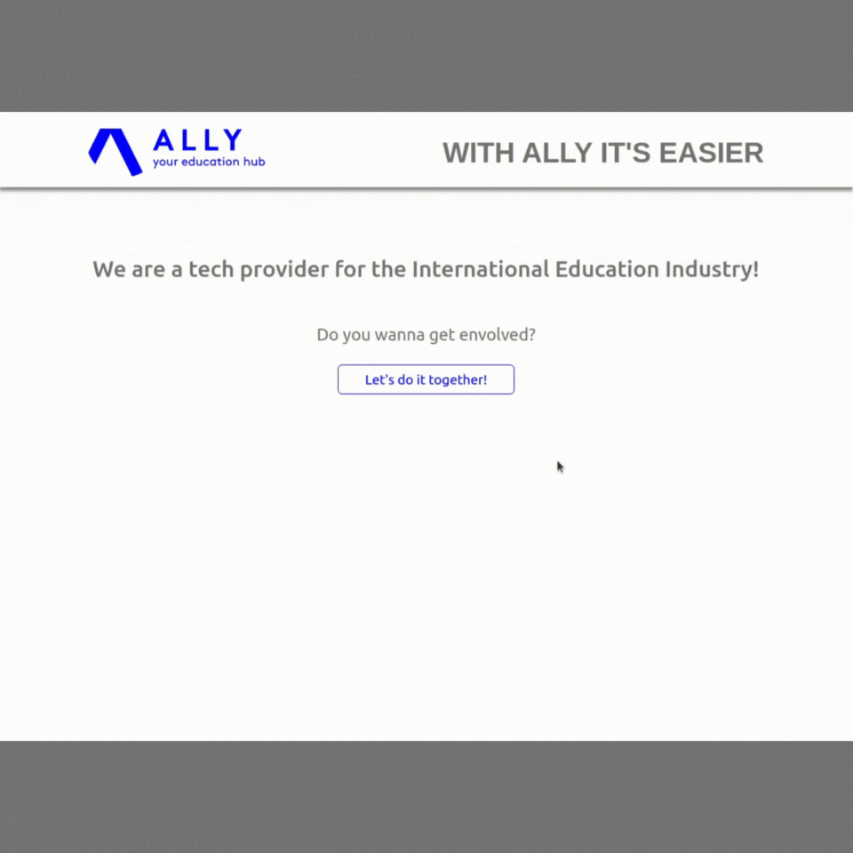
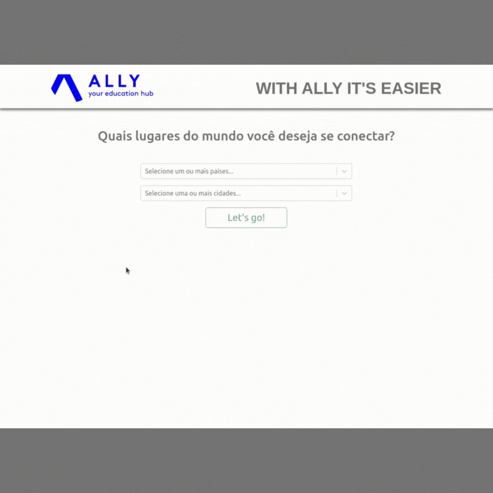

# Landing Page - Ally



## Descrição :memo:

Esta aplicação foi desenvolvida a partir de um WireFrame disponibilizado durante o Processo Seletivo, com o intuito de marcar destinos de interesse da pessoa usuária.

A partir daí, abstraí as informações de um formulário e implementei algumas páginas a mais: a página principal, a página de *not found* e a página de sucesso.

Além disso, a validação do formulário foi realizada utilizando o Formik. Nunca o tinha utilizado antes, mas achei que essa poderia ser uma ótima oportunidade de aprender e colocar uma camada a mais de segurança na minha aplicação.

Ela está hospedada em um domínio, através do Vercel, e pode ser acessada por este link [aqui](https://allyhub.vercel.app/).

---

## Tecnologias :wrench:

- ReactJS;
- ESLint;
- Vercel;
- CI/CD;
- CSS;
- [React Testing Library](https://testing-library.com/);
- [BootStrap](https://getbootstrap.com/);
- [React-BootStrap](https://react-bootstrap.github.io/);
- [Formik](https://formik.org/docs/overview);
- [CPF/CNPJ Validator](https://www.npmjs.com/package/cpf-cnpj-validator);
- [React-Select](https://react-select.com/home).

---

## Instalando a aplicação :file_cabinet:

Para clonar o repositório para a sua máquina e instalar as dependências, basta rodar o comando: 

- *Para chave SSH* 

```
git clone git@github.com:andremoraes98/allyhub.git && cd allyhub && npm install
```

Depois das dependências instaladas, basta rodar o comando:

```
npm start
```

Feito isso, a aplicação estará rodando localmente. Se não configurada uma porta específica, por padrão, a aplicação roda na porta 3000.

Depois que ela estiver rodando, basta seguir o fluxo dos botões dispostos para ter acesso ao formulário.

--- 

Feito com muito empenho, dedicação e esforço por [eu mesmo](https://www.linkedin.com/in/moraesandre/).